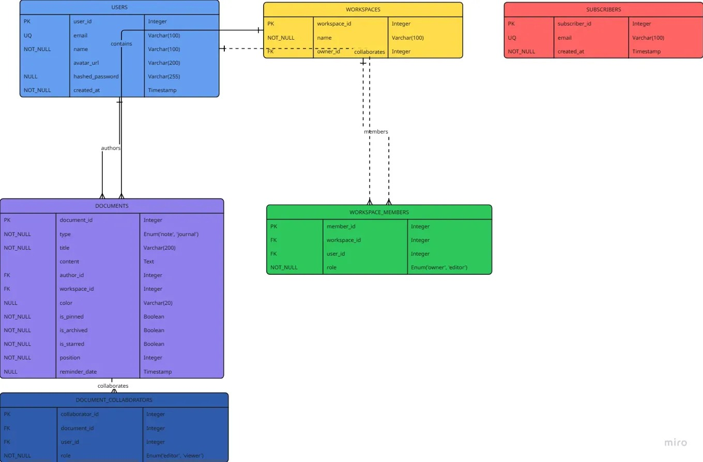

# 🎹 Keynotes: Real-Time Journaling & Collaborative Notes

<p align="center">
   
</p>

Keynotes is a modern, full-stack web application designed to be a sanctuary for your private thoughts and a dynamic hub for your collaborative ideas. It seamlessly blends a feature-rich, Google Keep-style notes platform with a private, introspective journaling space, all powered by a real-time, scalable, and serverless architecture.

This project was built to explore and implement professional-grade web development patterns, including real-time updates across multiple servers, a robust authentication system, and a highly interactive, modern user interface.

## 🔴 Live Demo

Check out the live version of the application deployed on Vercel:

**[https://keynotes2-0-bq9m.vercel.app/](https://keynotes2-0.vercel.app/)**

## ✨ Key Features

- **Real-Time Collaboration**: Powered by a Redis Pub/Sub system, collaborators see updates instantly without needing to refresh the page.

- **Dynamic Notes Interface**: A fluid, Google Keep-style UI featuring:
  - Drag-and-drop reordering of notes
  - In-place, modal-based editing
  - Feature-rich toolbar for pinning, archiving, and color-coding notes

- **Dual-Purpose Design**: A clear separation between a private, secure Journaling space and the collaborative Notes workspace.

- **Modern UI/UX**:
  - A Notion-style collapsible sidebar for intuitive navigation
  - A seamless light and dark mode theme toggle
  - Professional, animated UI components and interactive landing page sections

- **Secure Authentication**: A complete authentication system with both social login (Google) and traditional email/password providers.

- **Automated CI/CD Pipeline**: Every code change is automatically tested and deployed, ensuring code quality and reliability.

## 🛠️ Tech Stack & Architectural Decisions

This project uses a carefully selected, modern tech stack designed for performance, scalability, and an excellent developer experience.

| Technology | Role | Why It Was Chosen |
|------------|------|-------------------|
| **Next.js (App Router)** | Full-Stack Framework | The foundation of the app. Chosen for its powerful hybrid rendering model (Server Components for fast initial loads, Client Components for interactivity), file-based routing, and ability to build both frontend and backend logic in a single, cohesive codebase. |
| **React** | UI Library | The core of the frontend. Chosen for its component-based architecture, which makes building complex and reusable UI elements manageable and efficient. |
| **TypeScript** | Language | Used throughout the entire project. Chosen for its static typing, which catches errors during development, improves code quality, and provides a superior developer experience with autocompletion. |
| **Drizzle ORM** | Database Toolkit | Chosen for its lightweight, non-intrusive nature and raw SQL-like syntax. Its first-class TypeScript support provides end-to-end type safety from the database to the frontend. |
| **Neon** | Serverless Postgres | The primary database. Chosen for its modern, serverless architecture that scales to zero (making it highly cost-effective), its generous free tier, and innovative features like database branching. |
| **Upstash** | Serverless Redis | The real-time messaging backbone. Chosen to solve the challenge of real-time communication across multiple server instances on a serverless platform like Vercel. Its Pub/Sub system is the key to our instant collaboration features. |
| **NextAuth.js** | Authentication | A complete and secure authentication solution for Next.js. Chosen for its flexibility in handling multiple providers (Google, email/password) and its seamless integration with the Drizzle ORM adapter. |
| **Tailwind CSS** | CSS Framework | Used for all styling. Chosen for its utility-first approach, which allows for rapid development of custom, responsive designs without writing traditional CSS files. |
| **Shadcn/UI** | Component Library | Built on top of Tailwind CSS and Radix UI. Chosen to provide a set of beautiful, professional, and accessible UI components (buttons, modals, forms) out of the box, accelerating development. |
| **dnd-kit** | Drag-and-Drop Library | A modern, lightweight, and accessible library for building interactive drag-and-drop interfaces. Chosen for the Google Keep-style note reordering feature. |

## 🗃️ Database Schema

The database is designed to be relational and scalable, cleanly separating user data, content, and collaboration permissions.



- **users**: Stores user authentication and profile information.
- **workspaces**: Allows for high-level organization (though the current focus is on per-note collaboration).
- **documents**: The central table for all notes and journals, differentiated by a type column. Contains columns for features like `is_pinned`, `is_archived`, `is_starred`, and `color`.
- **document_collaborators**: The junction table that makes per-note collaboration possible by linking specific users to specific documents with defined roles.

## 🚀 Getting Started

To get a local copy up and running, follow these simple steps.

### Prerequisites

- Node.js (v18 or later)
- npm

### Installation & Setup

1. **Clone the repository:**
   ```bash
   git clone https://github.com/your-username/keynotes.git
   cd keynotes
   ```

2. **Install dependencies:**
   ```bash
   npm install
   ```

3. **Set up your environment variables:**
   
   Create a file named `.env.local` in the root of the project and add the following variables. You will need to get these from their respective platforms (Neon, Google Cloud Console, Upstash).
   
   ```env
   DATABASE_URL="..."
   GOOGLE_CLIENT_ID="..."
   GOOGLE_CLIENT_SECRET="..."
   NEXTAUTH_SECRET="..."
   NEXTAUTH_URL="http://localhost:3000"
   UPSTASH_REDIS_REST_URL="..."
   UPSTASH_REDIS_REST_TOKEN="..."
   ```

4. **Push the schema to your database:**
   
   This command will sync your Drizzle schema with your Neon database, creating all the necessary tables.
   
   ```bash
   npm run db:push
   ```

5. **Run the development server:**
   ```bash
   npm run dev
   ```

6. Open [http://localhost:3000](http://localhost:3000) with your browser to see the result.

## 🔐 Test Credentials

For convenience during local development and testing, you can use the following test account:

```
email: test12@gmail.com
password: test12@2003
```

Use these credentials with the app's email/password sign-in flow. Do not use this account for sensitive data in production.

## ⚙️ CI/CD Pipeline

This project is configured with a professional CI/CD pipeline to ensure code quality and automate deployments.

- **Continuous Integration (CI)**: Implemented using GitHub Actions. On every push or pull_request to the main branch, the workflow automatically runs:
  - **Linting**: Checks for code style and formatting errors
  - **Type Checking & Building**: Performs a full production build to catch any TypeScript errors or build failures before they can be deployed

- **Continuous Deployment (CD)**: Handled by Vercel. Every successful push to the main branch is automatically built and deployed to the live environment with zero downtime.

## Test Credentials
- Email-test12@gmail.com
- Password= test12@2003

## Maintainer Contact
- Email - beesoul98012@gmail.com
